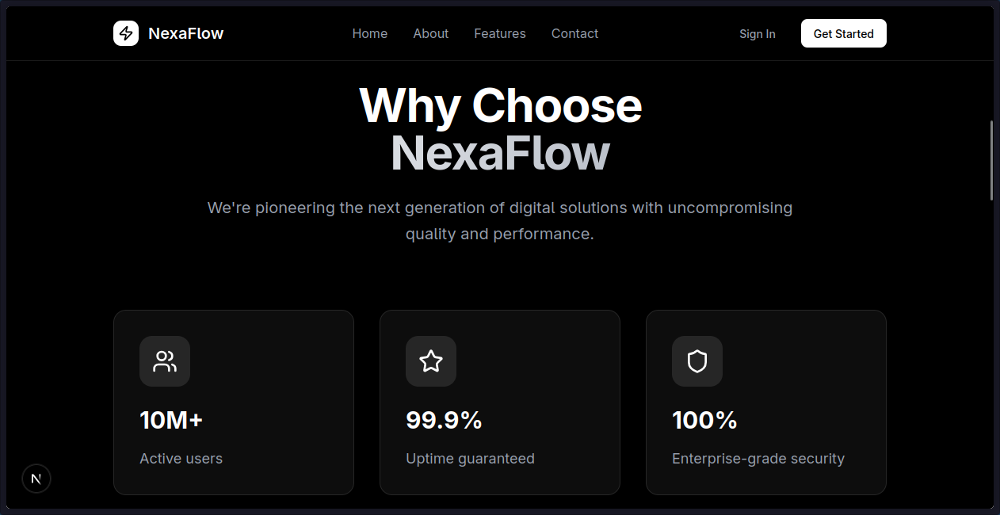
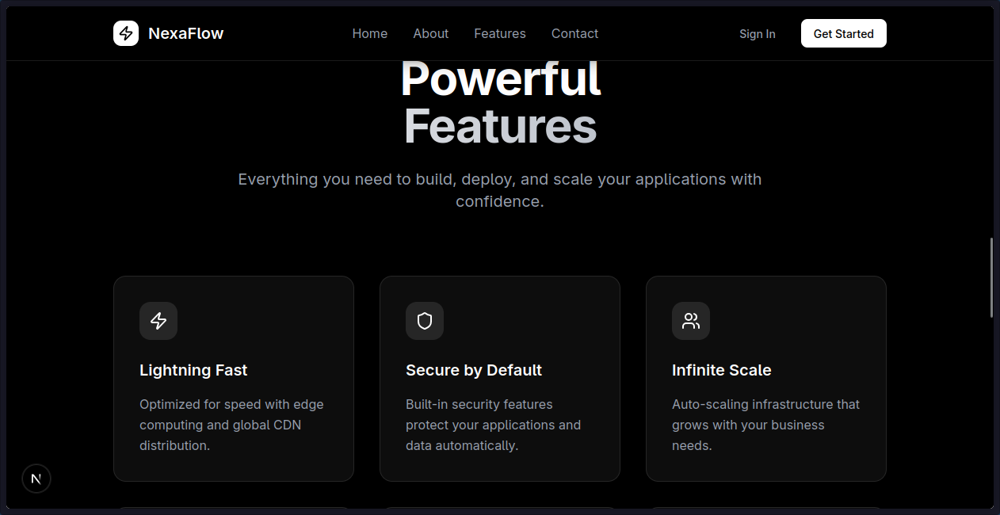

# Nexa Landing Page
landing page for nexa project with animations.

## How to Run the project

### Clone the repo
```bash
git clone https://github.com/Xenos112/nexa-landing-page.git
```

### Install deps
```bash
bun i # or use your prefered package manager
```

### Run the Project
```bash
bun dev
```
then navigate to [http://localhost:3000](http://localhost:3000)


## Screenshots




